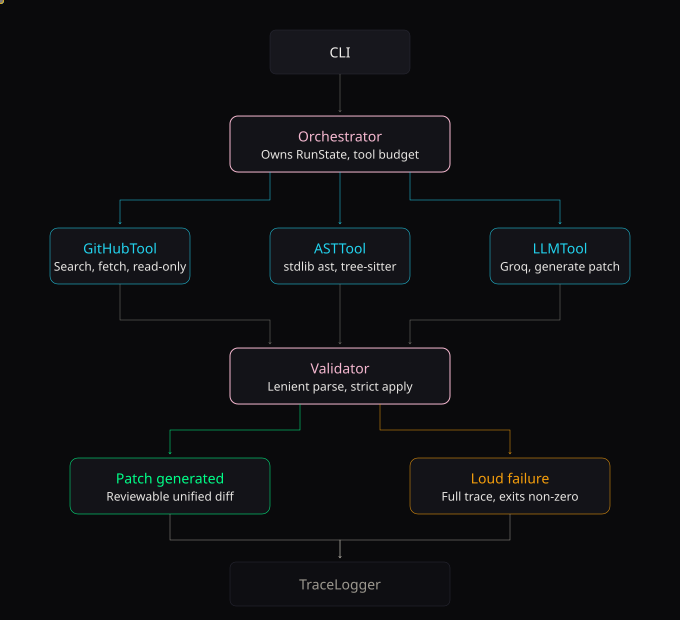

# Coding Agent

An autonomous CLI agent that takes a **natural-language bug report + a GitHub
repo** and produces a **reviewable unified diff** — without you pointing it at
the right file.

It runs the loop every engineer runs by hand: read the report → find the
relevant files → read them → write a patch that applies. Unlike a naive
"paste-one-file" LLM demo, it locates the relevant code structurally (AST),
respects a hard tool-call budget, and explicitly tells you when it *can't*
patch confidently instead of guessing.

---

## Why

The slow part of fixing a bug in an unfamiliar codebase isn't writing the fix —
it's **finding where to look**. This agent automates the search → read →
generate loop with real tool use (GitHub API + AST parsing), honest failure
handling, and a full trace of every decision so the loop itself can be debugged.

Phase 3 measured it against **16 real closed GitHub issues** (see
*Reproducibility*). It is a portfolio/learning artifact: current task-completion
is low and reported honestly, because the point was to *find* where the loop
breaks, not to claim it works.

## Features

- 🔎 **Identifier-focused code search** — extracts `snake_case`/`CamelCase`/
  backticked symbols from the report (raw prose confuses GitHub's lexical
  search into returning `CHANGES.md`)
- 🌳 **AST-structured context** — the model sees the *functions named in the
  bug report* with real bodies, not a raw file dump
- ✅ **Lenient-but-safe patch validation** — tolerates LLM whitespace/quirkiness,
  but hard-rejects patches touching files it never read, or producing invalid
  Python
- 💰 **Hard tool-call budget** — enforced at the orchestrator; a bad search loop
  can't burn API quota
- 🔇 **Loud failure** — a clear "could not patch confidently" path with a full
  trace, instead of a confidently-wrong patch
- 📜 **Full JSON trace** of every tool call (inputs/outputs/duration) for
  later analysis — secrets redacted at capture time

## Install

Requires **Python 3.11+**.

```bash
git clone https://github.com/abdullahhshafique/coding-agent.git
cd coding-agent
python -m venv .venv && source .venv/bin/activate   # Windows: .venv\Scripts\activate
pip install -r requirements.txt
pip install -e .
```

### Configure credentials

```bash
cp .env.example .env
```

Then set two variables in `.env` (read from the environment only, never
committed, redacted from all traces):

```bash
export GITHUB_TOKEN=ghp_...     # fine-grained PAT, public-repo read scope only
export GROQ_API_KEY=gsk_...     # https://console.groq.com/keys
```

## Usage

```bash
# Fix from an issue URL (fetches the issue text itself)
coding-agent fix --repo pallets/click \
  --issue-url https://github.com/pallets/click/issues/3458

# Or paste a bug description directly
coding-agent fix --repo owner/repo --issue "Clicking export crashes when the list is empty"

# Limit the tool-call budget (default 20)
coding-agent fix --repo owner/repo --issue "..." --budget 12
```

### Example output

```text
====================================================
PATCH GENERATED
====================================================
Patch:  ./output/pallets-click-20260801_075908.patch
Trace:  ./output/pallets-click-20260801_075908.trace.json

Rationale: Context.get_parameter_source returned None for parameters with a
default value; restored ParameterSource.DEFAULT fallback ...
```

`./output/…-….patch` (a real run against a reported Click bug):

```diff
--- src/click/core.py
+++ src/click/core.py
@@
-        return self._parameter_source.get(name)
+        src = self._parameter_source.get(name)
+        if src is not None:
+            return src
+        # If the parameter has a default and was not explicitly set,
+        # treat it as coming from the default source.
+        for param in self.command.params:
+            if param.name == name:
+                if param.default is not None:
+                    return ParameterSource.DEFAULT
+                break
+        return None
```

On failure it prints a `COULD NOT GENERATE CONFIDENT PATCH` banner with the
reason and the trace path, and exits non-zero — it never silently guesses.

## How it works

```
CLI → Orchestrator ──┬─► GitHubTool  (search code, fetch file/issue, read-only)
                     ├─► ASTTool     (stdlib ast → tree-sitter fallback)
                     ├─► LLMTool     (Groq: generate_patch / explain_patch)
                     ├─► Validator   (lenient parse, strict & safe apply)
                     └─► TraceLogger / OutputWriter
```

The orchestrator owns a per-run `RunState` and the hard budget; tools expose a
uniform typed contract so any one of them (GitHub→GitLab, Groq→another
provider) is swappable without touching the loop. See `Architecture.md`.



## Development

```bash
python -m pytest          # 105 tests
python -m ruff check .    # lint
python -m mypy src        # type check (strict)
```

## Reproducibility & honest results

Phase 3 ran the agent against **16 real closed GitHub issues** (click/jinja/
werkzeug) with ground truth from the merged fix PRs.

| Metric (PRD §4) | Target | Measured |
|---|---|---|
| Task completion (semantic correctness) | ≥60% | **6.2%** (1/16) |
| Search precision | ≥50% | **13%** |
| Search recall | ≥80% | **34%** |
| Loop failure rate | <10% | **0%** |
| Explainability | 100% | **100%** |
| Avg tool calls / duration | — | 9.1 / 32 s |

Numbers are reported as measured, not rounded. Full data + failure-mode
analysis: `docs/phase3_evaluation.md` · raw data: `output/evaluation/`.

Re-run it yourself: `python run_evaluation.py` (resumable; needs both API keys
and Groq quota).

## Roadmap

- [ ] local clone + grep fallback when code search finds nothing
- [ ] per-retry validator error feedback into the generation prompt
- [ ] surgical-function context (caller/callee window) to cut wrong-edit rate
- [ ] JS/TS support · auto-apply to a local branch · draft-PR mode

## Scope & non-goals

Read-only against GitHub. Never auto-commits, pushes, or applies patches. No
auto-PR. A draft patch for human review is the entire output contract.

## License

MIT
